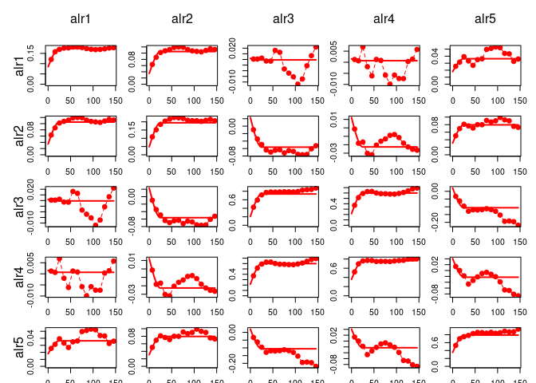

<!-- README.md is generated from README.Rmd. Please edit that file -->

# gmGeostats

<!-- badges: start -->

<!-- badges: end -->

The goal of gmGeostats is to provide a unified framework for the
geostatistical analysis of multivariate data from any statistical scale,
e.g. data honoring a ratio scale, or with constraints such as spherical
or compositional data.

This R package offers support for geostatistical analysis of
multivariate data, in particular data with restrictions, e.g. positive
amounts data, compositional data, distributional data, microstructural
data, etc. It includes descriptive analysis and modelling for such data,
both from a two-point Gaussian perspective and multipoint perspective.
The package is devised for supporting 3D, multi-scale and large data
sets and grids. This is a building block of the suite of HIF
geometallurgical software.

## Installation

You can install the released version of gmGeostats from
[CRAN](https://CRAN.R-project.org) with:

``` r
install.packages("gmGeostats")
```

## Example

Read the package vignette for an extended scheme of the package
functionality. The fundamental steps are:

``` r
## load the package and its dependencies
library(gmGeostats)
#> Welcome to 'gmGeostats', a package for multivariate geostatistical analysis.
#>  Note: use 'fit_lmc' instead of fit.lmc

## read your data, identify coordinates and sets of variables
data("Windarling") # use here some read*(...) function
colnames(Windarling)
#>  [1] "Hole_id"     "Sample.West" "Sample.East" "West"        "East"       
#>  [6] "Easting"     "Northing"    "Lithotype"   "Fe"          "P"          
#> [11] "SiO2"        "Al2O3"       "S"           "Mn"          "CL"         
#> [16] "LOI"
X = Windarling[,c("Easting", "Northing")]
Z = Windarling[,c(9:12,14,16)]

## declare the scale of each set of variables
Zc = compositions::acomp(Z) # other scales will come in the future

## pack the data in a gmSpatialModel object using an appropriate
#     make.** function
gsm = make.gmCompositionalGaussianSpatialModel(
  data = Zc, coords = X, V = "alr", formula = ~1
)
```

From this point on, what you do depends on which model do you have in
mind. Here we briefly cover the case of a Gaussian model, though a
multipoint approach can also be tackled with function
`make.gmCompositionalMPSSpatialModel()` providing a training image as
model. See the package vignette for details.

A structural analysis can be obtained in the following steps

``` r
## empirical structural function
vge = variogram(gsm)

## model specification
vm = gstat::vgm(model="Sph", range=25, nugget=1, psill=1)
# you can use gstat specifications!

## model fitting
gsm.f = fit_lmc(v = vge, g = gsm, model = vm)

## plot
variogramModelPlot(vge, model = gsm.f)
```



This model can then be validated, interpolated and/or simulated. The
workflow for each of these tasks is always:

1.- define some method parameters with a tailored function, e.g.
`LeaveOneOut()` for validation, `KrigingNeighbourhood()` for cokriging
or `SequentialSimulation()` for sequential Gaussian Simulation

2.- if desired, define some new locations where to interpolate or
simulate, using `expand.grid()` or `sp::GridTopology()` or similar

3.- call an appropriate function, specifying the model, potential new
data, and the parameters created in the preceding steps; e.g.
`validate(model, pars)` for validation, or `predict(model, newdata,
pars)` for interpolation or simulation

More information can be found in the package vignette.
